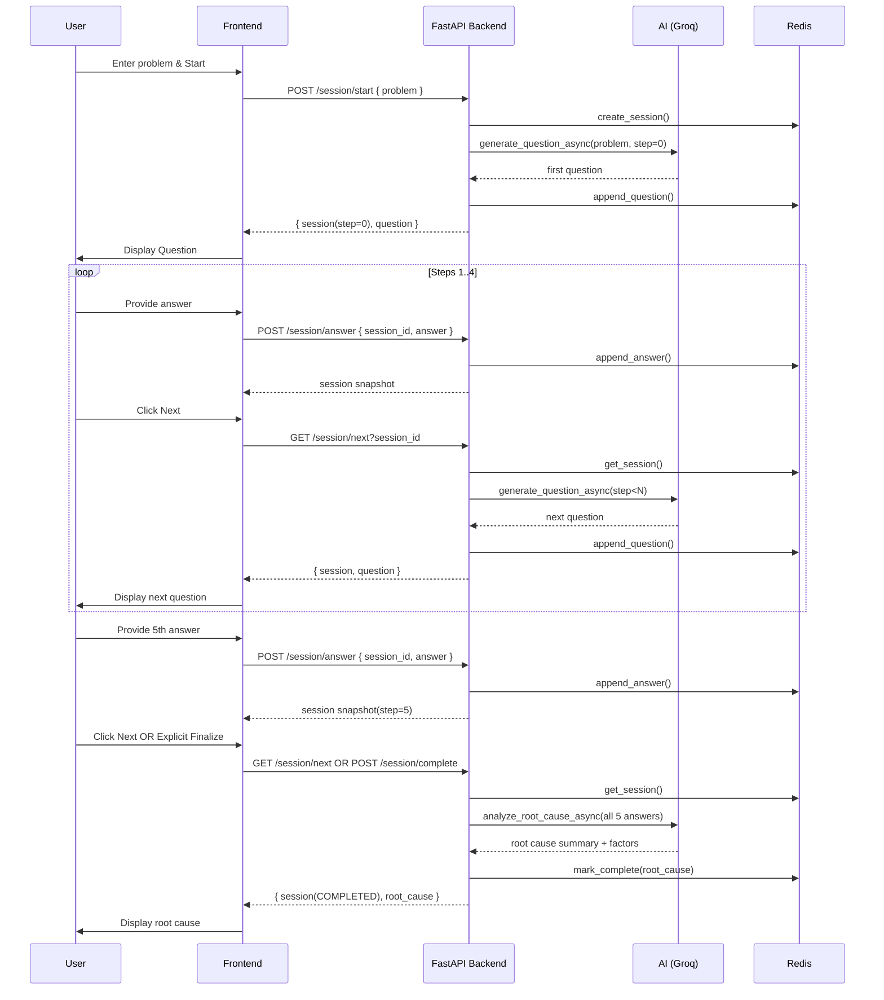

# 5 Whys Session Flow

## Lifecycle States

| Step | Answers | Action `next` | Result |
|------|---------|---------------|--------|
| 0    | 0       | generate Q1   | question |
| 1-4  | 1-4     | generate next | question |
| 5    | 5       | analyze       | root_cause |
| >5   | -       | idempotent    | existing root_cause |
